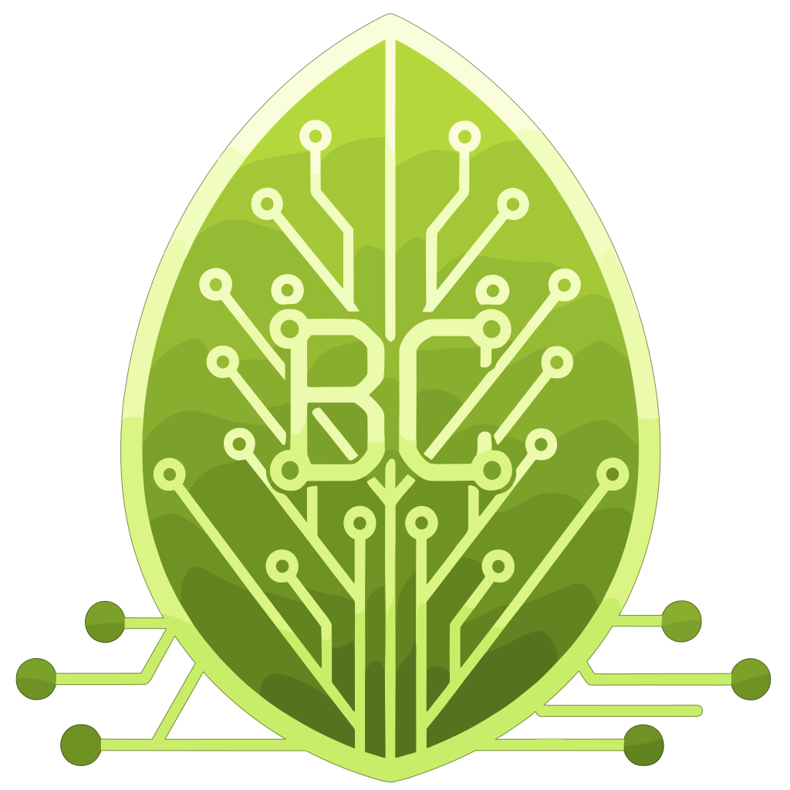

<p align="center">
  
</p>

<h1 align="center">bcordes.dev</h1>

<p align="center">
  <strong>Full-stack portfolio & web application by Bryan Cordes</strong>
</p>

<p align="center">
  
  
  
  
  
  
</p>

<p align="center">
  
  
  
  
</p>

<p align="center">
  
  
  
  
  
</p>

---

## About

**bcordes.dev** is a server-side rendered full-stack web application built with [TanStack Start](https://tanstack.com/start) and powered by React 19. It serves as a professional portfolio and technical showcase featuring real-time data, authentication, and a modern component-driven UI.

### Highlights

- **Server-Side Rendering** — TanStack Start with Nitro for fast, SEO-friendly pages
- **Authentication** — OIDC-based auth flow with sealed sessions and automatic token refresh
- **Real-time Updates** — Server-Sent Events (SSE) streaming for live data
- **Modern UI** — Custom green-on-white theme built with Tailwind CSS v4 and shadcn/ui
- **Database** — PostgreSQL 16
- **Backend Integration** — Connected to the .NET Wallow API with retry logic
- **CI/CD** — Docker multi-stage builds published to GHCR, deployed via Portainer

## Tech Stack

| Layer         | Technologies                             |
| ------------- | ---------------------------------------- |
| **Framework** | TanStack Start, React 19, Vite 7         |
| **Routing**   | TanStack Router (file-based)             |
| **Data**      | TanStack Query, PostgreSQL 16            |
| **Styling**   | Tailwind CSS v4, shadcn/ui, Lucide icons |
| **Auth**      | OpenID Connect, iron-webcrypto sessions  |
| **Real-time** | Server-Sent Events (SSE)                 |
| **Forms**     | React Hook Form + Zod                    |
| **Testing**   | Vitest, Testing Library                  |
| **Tooling**   | ESLint, Prettier, Storybook 9            |
| **Infra**     | Docker, GitHub Actions, GHCR, Portainer  |

## Getting Started

```bash
pnpm install
pnpm dev
```

## Scripts

| Command          | Description                   |
| ---------------- | ----------------------------- |
| `pnpm dev`       | Start dev server on port 3000 |
| `pnpm build`     | Production build              |
| `pnpm test`      | Run tests with Vitest         |
| `pnpm lint`      | Lint with ESLint              |
| `pnpm format`    | Format with Prettier          |
| `pnpm check`     | Format + lint fix             |
| `pnpm storybook` | Launch Storybook on port 6006 |

## Project Structure

This repo is a **pnpm workspace monorepo**: the releasable app lives in `apps/web`, and shared code is extracted into 13 internal `@bcordes/*` libraries under `packages/*`.

```
.
├── apps/
│   └── web/                 # TanStack Start application (package: bcordes)
│       ├── src/
│       │   ├── routes/          # File-based route definitions (incl. api/notifications/stream.ts SSE)
│       │   ├── features/        # Feature modules (home, about, projects, contact, inquiries, notifications) — each a public src index.ts, internals private
│       │   ├── shared/          # Cross-cutting app modules (e.g. auth) with the same public-API discipline
│       │   ├── components/      # Shared app components (layout, shared); feature components live under features/<name>/components/
│       │   └── hooks/           # App-local hooks (SSE event stream, auth, animations)
│       └── e2e/                 # Playwright e2e suite
└── packages/                # Internal @bcordes/* libraries (private, workspace:*)
    ├── config/              # Shared ESLint / Prettier / tsconfig base
    ├── utils/               # Framework-agnostic helpers
    ├── logger/              # Structured logging
    ├── valkey/              # Valkey/Redis client
    ├── query/               # TanStack Query integration
    ├── auth/                # OIDC authentication + sealed sessions
    ├── authz/               # Authorization predicates
    ├── server/              # Server middleware (CSRF, security headers)
    ├── wallow/              # Wallow backend API client
    ├── ui/                  # Base UI component library
    ├── forms/               # Form field components
    ├── navigation/          # Main/mobile navigation
    └── test-utils/          # Shared test setup + render helpers
```

Each package exposes its public API from `src/index.ts` and is consumed via its `@bcordes/<name>` entry point. Work on a single project with pnpm filters:

```bash
pnpm --filter bcordes dev                    # run the app
pnpm --filter @bcordes/ui test               # test one package
pnpm -r typecheck                            # typecheck the whole workspace
pnpm --filter bcordes exec playwright test   # run the e2e suite
```

## License

Private repository.
